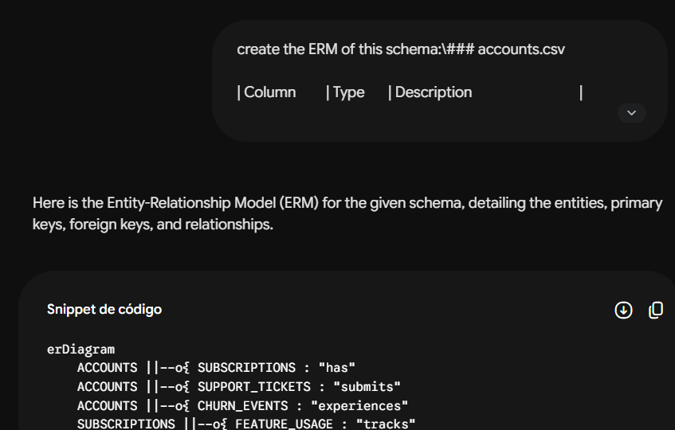
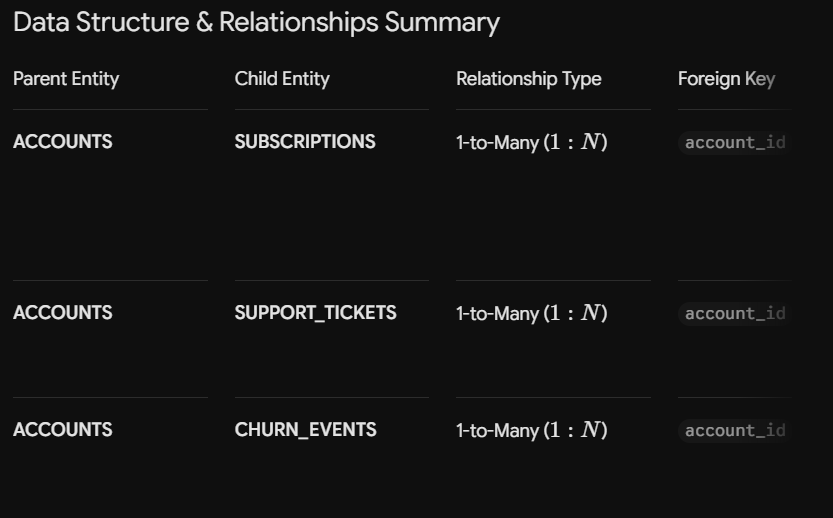
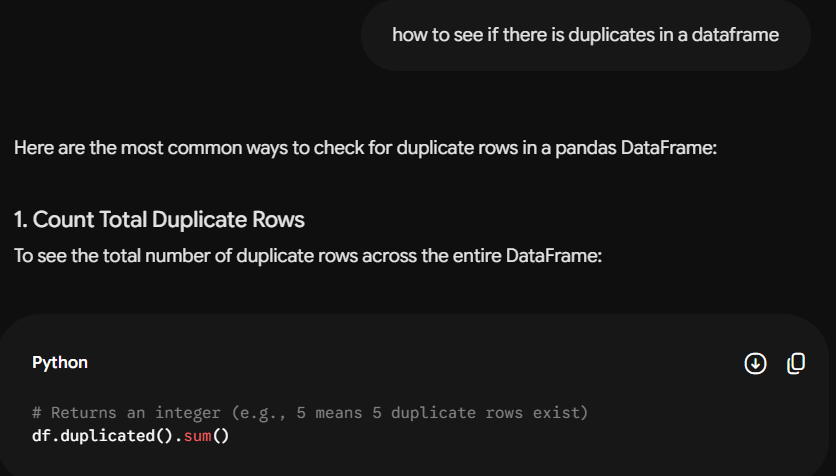
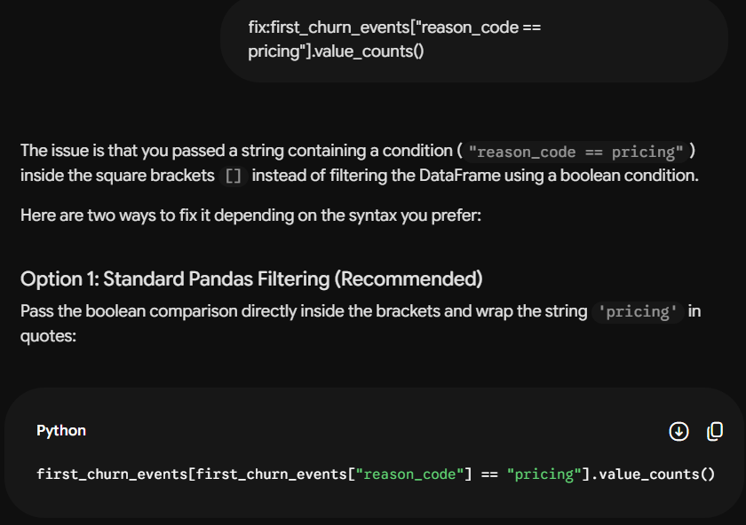
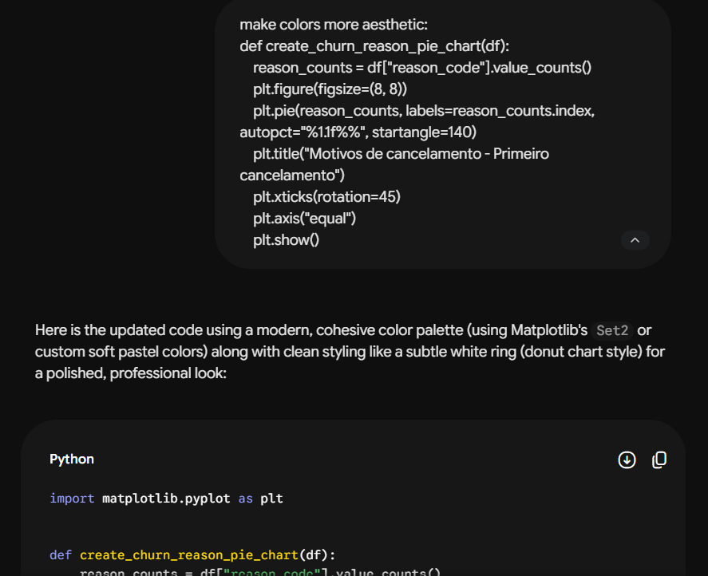
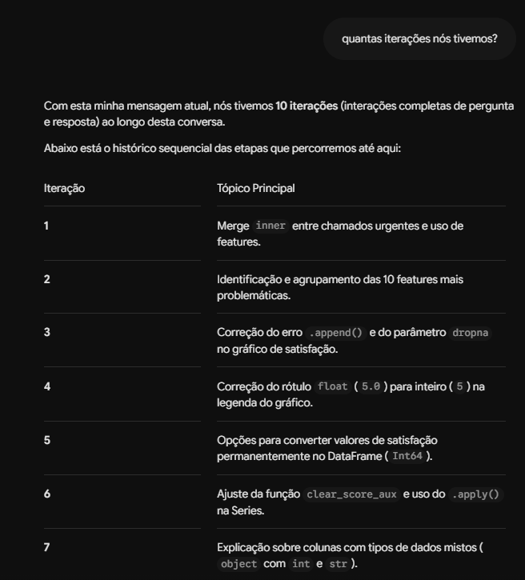
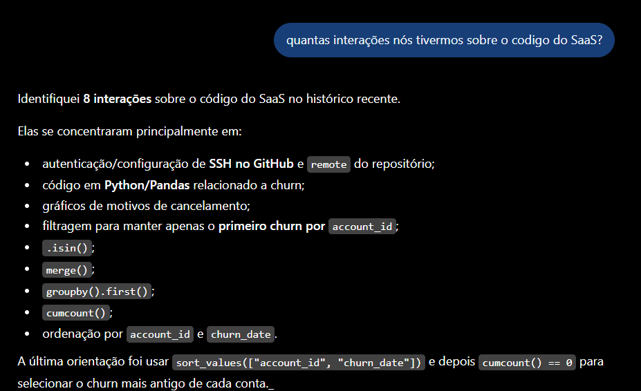

# Process report

Inicialmente, eu busquei entender o relacionamento das tabelas e o que cada coluna de cada tabela significa. Eu fiz o diagrama MER a mão e pedi para o Gemini fazer um também para eu comparar:

Obviamente eu não passei os dados, apenas o schema que estava no README. A resposta não foi examente o eu queria, porque eu preferiria que o chat fizesse o diagrama visual, mas pelo texto era possível identificar as relação e cardinalidade e comparar com as que eu tinha feito.

Após entender as relações e cardinalidades, eu fiz uma análise exploratória básica, para ver as informações das tabelas, shape, olhar os dados. Nessa parte e no restante o código, eu usei IA para corrigir gramática ou me relemebrar algum comando.

Também usei IA para os gráficos ficarem mais bonitos.

Após a análise exploratória, eu fui montando um plano de ação, primeiro analisar a tabela de churn, depois olhar os tickets, as features usadas e assim por diante.

Eu usei chatGPT, Gemini e o copilot. O meu copilot fica ativo, então eu vou escrevendo e aí vai aparecendo correção da escrita, mas eu não costumo fazer perguntas direto, normalmente eu uso o chatGPT e o Gemini mais. Eu uso eles por serem as mais convencionais, mas às vezes eu testo outros o deepSeek, manus, etc. Eu costumo trocar de IA quando uma delas fica dando respostas muito repetitivas que não contribuem. Como para código eu uso mais para correção de sintexe ou lembrar de funções, não acontece tanto.

Não diria que a IA errou em alguma resposta, acho que é mais saber raciocionar o problema e analisar se a resposta está de acordo com o que você quer. 

A IA faz muita coisa e qualquer coisa que você pedir, vai gerar uma resposta, mas não necessariamente confiável. Como decisões de analytics dão suporte para ações futuras, acho que a diferença é se aqueles números gerados você confia ou não.

Número de iterações:

Resposta do Gemini:

Resposta do chatGPT:

