# Diagnóstico de Churn

O dataset compreende 500 contas, das quais 352 (70,4%) já cancelaram o serviço (churn). Dentre os eventos de churn, 142 de 600 (23,7%) envolveram reembolso (refund). Como as solicitações de reembolso representam a minoria dos cancelamentos e o churn sem reembolso também acarreta perda direta de receita recorrente futura, a análise de churn abordará a base globalmente, contemplando tanto as contas com quanto sem refund.

O principal motivo apresentado para cancelamentos em Reason Code são "features", tanto em accounts que cancelaram pela primeira vez quanto no segundo cancelamento em diante.

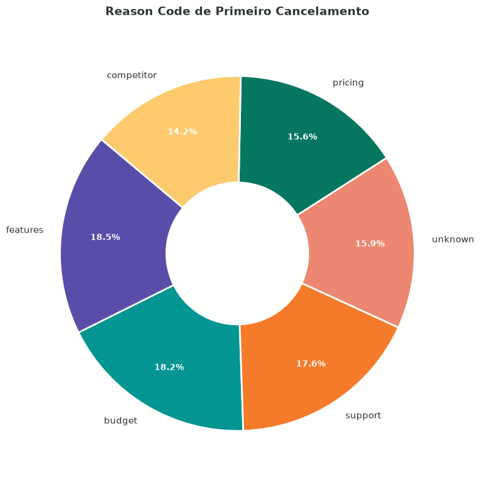

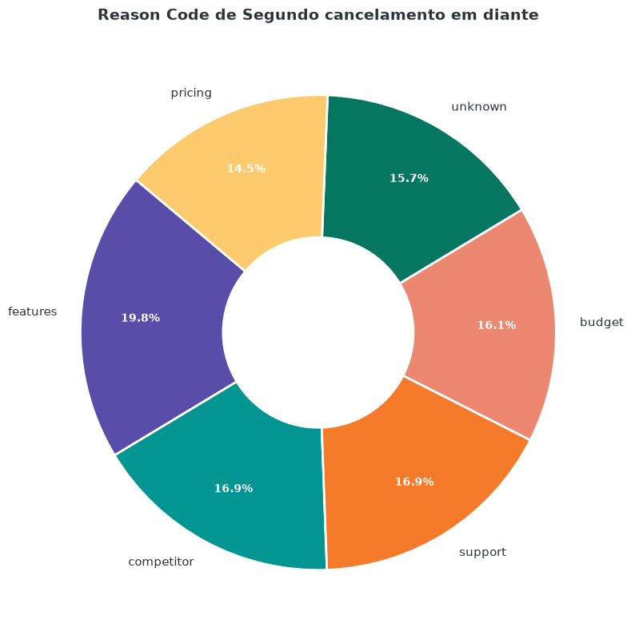

Como pode ser observado, os Reason Code estão equlibrados em percentual. Assim, além de features, suporte, preço e unkown devem ser considerados.

Ao analisar as accounts que adicionaram um feedback, o principal motivo de cancelamente apresentado são features faltantes:

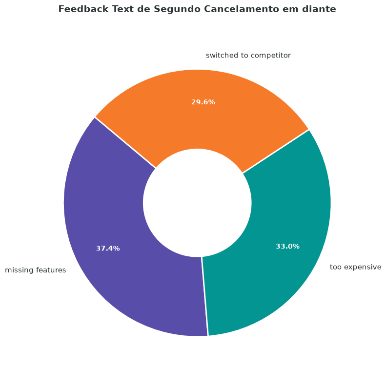

Ao analisar o feedback dos eventos de churn que possuem Reason Code exclusivamente "UNKOWN", features faltantes  aparece como motivo principal no primeiro cancelamento e preço no segundo cancelmento.

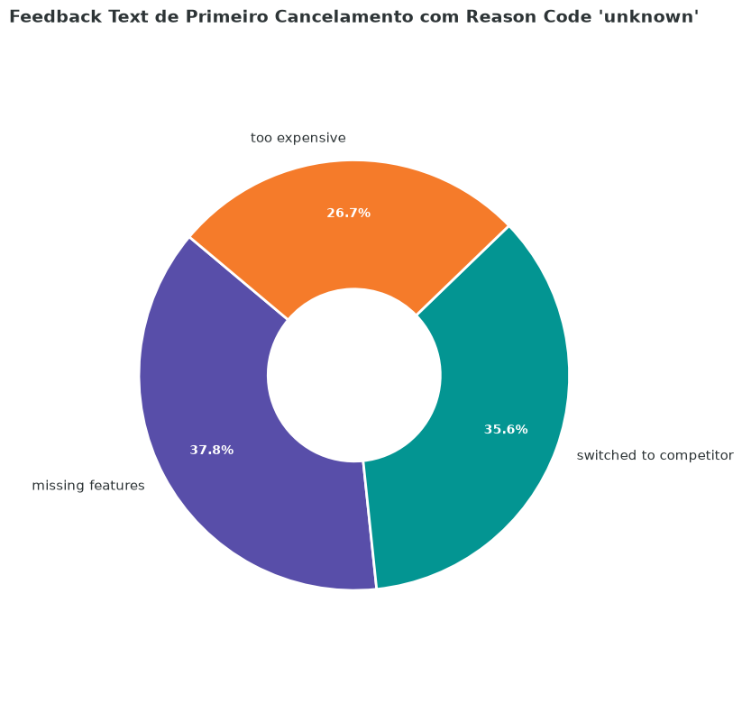

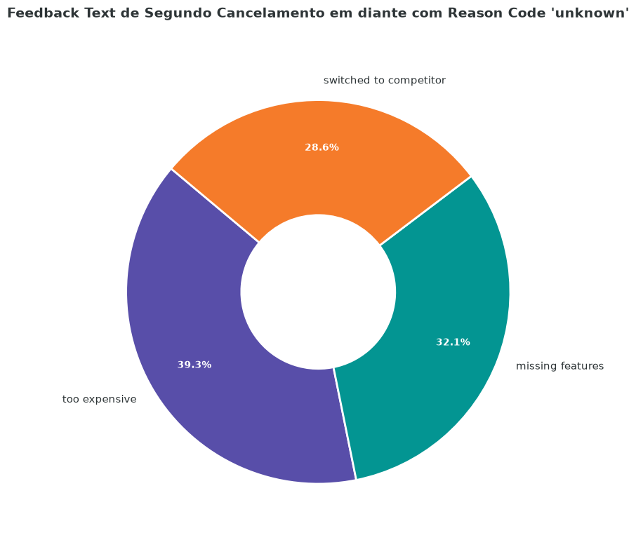

Dessa forma, no geral, pode-se concluir que as features faltantes são o principal motivo de churn. Uma vez que os demais Reason Code também possuem porcentagem significativa, os demais devem ser analisados. Como não há dados sobre valores financeiros, será analisado o suporte.

## Tickets

Em relação aos tickets, 492 das 500 accounts já abrim tickets (90.4%). Idealmente, esse número deveria ser 0% ou bem próximo de 0%, pois o SaaS seria tão intuivo, bem implementado, que não haveria motivo para abrir tickets. Os tickets estão bem distribuidos quanto à prioridade, como pode ser observado abaixo:

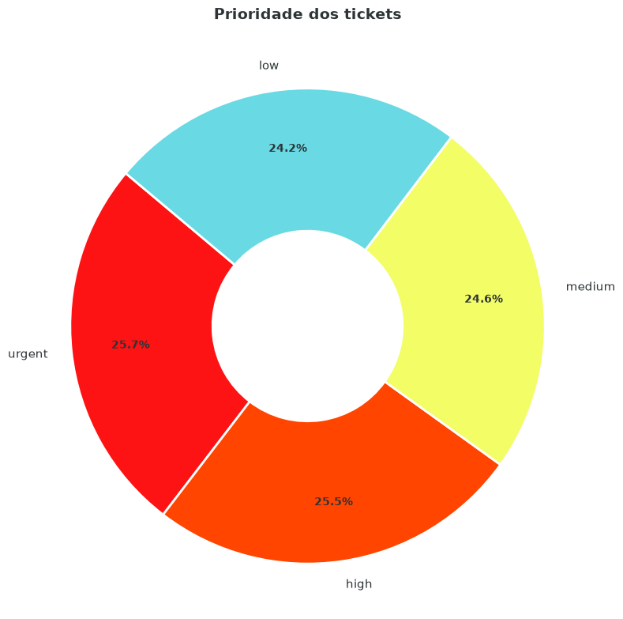

Dessa forma, não uma prioridade que aparece muito mais que as demais.

Em relação à satisfação, o percentual que avalia o suporte como 5 (máxima qualidade) não é alto, porém como a porcetagem de pessoas que não respondem é signifitiva nesse contexto, é necessário uma análise mais profunda.

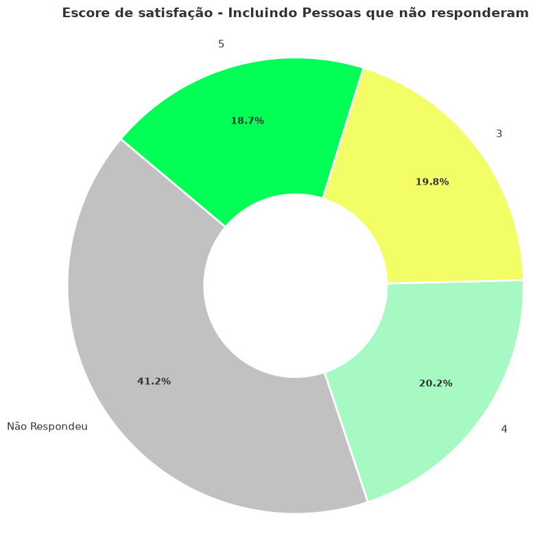

Sobre o tempo de resolução, é possível perceber pelos gráficos abaixo, que independente da prioridade do ticket, a maioria costuma levar mais de 20 horas para serem resolvidos.

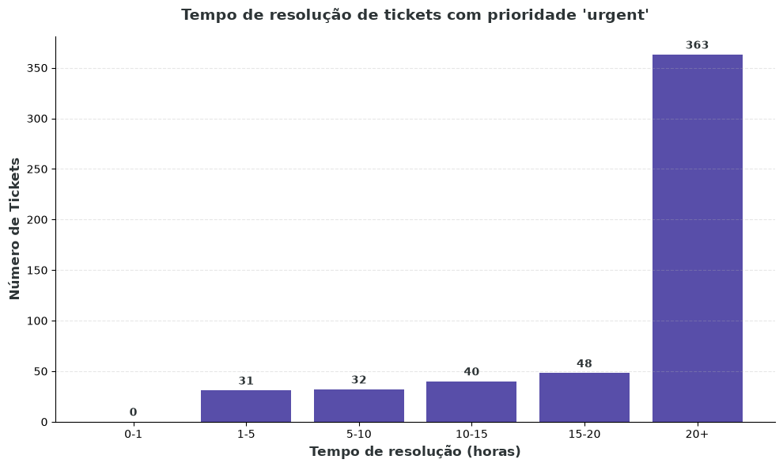

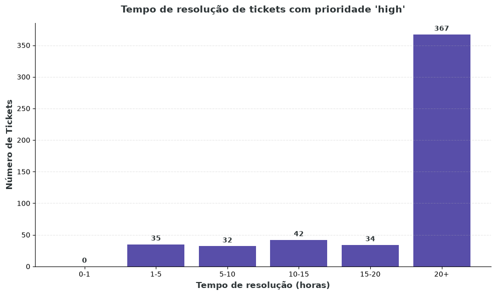

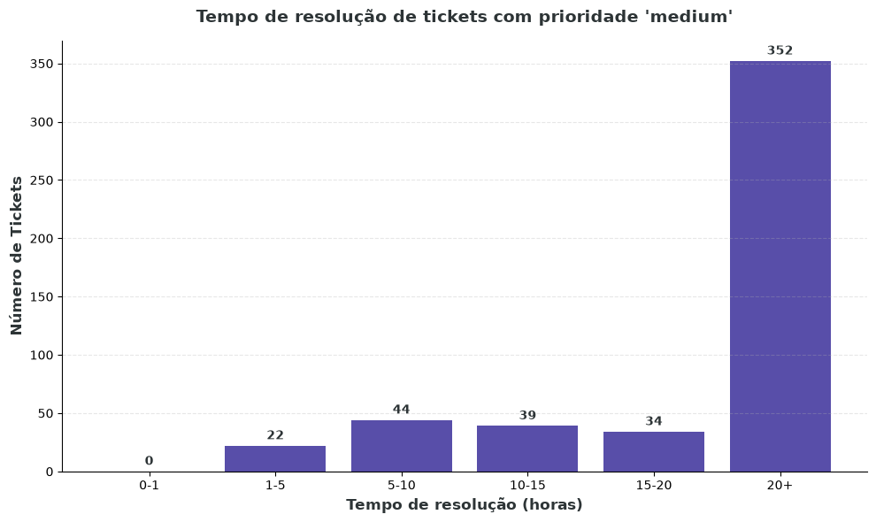

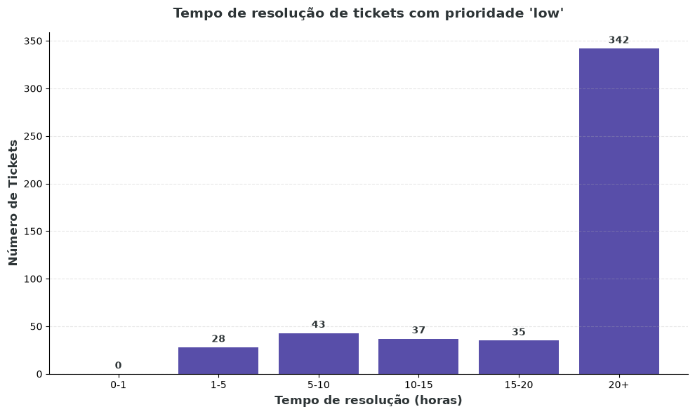

Dessa forma, é possível concluir que na prática, a prioridade do ticket não é efetiva. A maioria leva mais de 20 horas para serem solucionados, o que é um tempo elevado. Isso é especialmente preocupante em tickets com prioridade "urgent" ou "high", pois dependendo do problema reportado, pode ser algo que cause um impacto financeiro para o cliente.

## Features
Em geral, as features são  utilizadas igualmente. Na tabela de tickets, não há um indicativo de qual feature está sendo discutida, o que poderia ajudar a análise de melhoria do SaaS. 

Realizando um filtro entre features mais utilizadas pelas accounts que abriram tickets com prioridade 'urgent' ou 'high', as top10 mais utilizadas foram:

* feature_32    
* feature_24    
* feature_36    
* feature_12    
* feature_2     
* feature_26    
* feature_20    
* feature_22    
* feature_34    
* feature_31    

Realizando esse filtro para accounts que churned, as top10 features mais utilizadas foram:

* feature_12    
* feature_6     
* feature_32    
* feature_34    
* feature_17    
* feature_26    
* feature_31    
* feature_10    
* feature_15    
* feature_24    

A interseção desses dois grupos é composta por:

* feature_12    
* feature_6     
* feature_32    
* feature_34    
* feature_17    
* feature_26    
* feature_31    
* feature_10    
* feature_15    
* feature_24   

Não necessariamente essas features possuem algum problema, porém como são bastante usadas por contas de churn ou possuem muitos tickets com prioridade 'urgent' ou 'high', seria interessante fazer teste de software nelas.

# Resumo:

Motivo principal de churn: **Features Ausentes**.

Gargalos identificados: 
* Features ausentes.
* Elevado tempo de resolução de tickets, inclusive para tickets com prioridade urgent/high.
* Ineficiência no processo de triagem e priorização de chamados.

Recomendações: 

* Produtos: Conduzir uma pesquisa com a base de clientes para mapear as features mais solicitada e as que causam mais problemas.
* QA: Alocar a equipe para uma varredura intensiva de testes nas features 6, 10, 12, 15, 17, 24, 26, 31, 32, 34. Após a conclusão da pesquisa, alocá-los nas features reportadas pelos clientes.
* Dev: Implementar as features solicitadas pelos clientes.
* Suporte: Capacitar a equipe de atendimento para otimizar o tempo de resolução dos tickets e melhora da triagem.

 